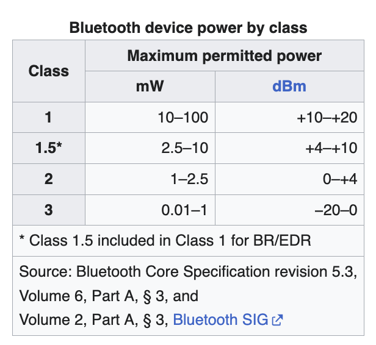

# Overview

Has been managed by Special Interest Group (SIG), and used to be standardized by [IEEE 802.15.1](https://en.wikipedia.org/wiki/IEEE_802.15) (IEEE working group numbers are really cool, like 802.3 for Ethernet and 802.11 for WLAN/WiFi)

Other important things to look at 
- Host Controller Interface ([HCI](https://en.wikipedia.org/wiki/Bluetooth_protocols#Host/controller_interface_(HCI)))
- Protocol stack
- Pairing?
  - Might be important for the Airtag stuff

# History of Bluetooth
### The name:
- Comes from a Danish king named Harald Bluetooth, 
- Was only intended as a placeholder
- Going to be PAN (Personal Area Networks)
  - It was already was used a lot on the internet for general PANs
- Then RadioWire was considered 
  - Couldn't complete a full trademark search, so went with Bluetooth

### Development of Special Interest Group (SIG)
- "short-link" radio technology in Lund, Sweden (at Ericsson Mobile)
- Started in 1989, had solution by 1997
- IBM R&D collaboration
  - Tried to put into ThinkPad (with mobile phone), but power req. too high
- Made short-link radio tech OPEN INDUSTRY STANDARD
  - Recruited Intel, who also recruited Toshiba and Nokia
- 1998 - Made Bluetooth Special Interest Group (SIG)

### Early dev
- Products!
  - 1999 - Hands-free mobile headset (wikipedia not clear what it actually was)
    - "Best of show Technology Award" at [COMDEX](https://en.wikipedia.org/wiki/COMDEX) (COMputer Dealers' EXhibition in Vegas, super cool thing).
  - 2001 Q1 - Erisson model T39 (First mobile phone)
  - 2001/06 - Erisson model T39 (First mobile phone)
  - 2001/10 - IBM ThinkPad A30 (First notebook)
- Vosi tried to implement into phone-vehicle link (WiFi not that available or widely used yet) but lost legal battle against Motorola

<!-- -------------------------------------------------- -->
# Specification (kinda)

### Transmission
- 2.4 Ghz (2.402 and 2.480)
  - In unlicensed industrial, scientific and medical (ISM) 
- [Frequency-hopping spread spectrum](https://en.wikipedia.org/wiki/Frequency-hopping_spread_spectrum)
- 79 channels - 1 MHz bandwidth
- 1600 hops/second
- Datarate
  - 1 Mbits/s for Gaussian frequency-shift keying (GFSK)
  - Up to 8 with other

### Network
- Packet-based
- Master/slave
  - Can communicate with up to 7 slaves
  - [Piconet](https://en.wikipedia.org/wiki/Piconet) - kinda cool
    - Can have 7 active slaves, with 255 "parked" but inactive
    - Anyone can become master
    - Multiple form a [scatternet](https://en.wikipedia.org/wiki/Scatternet)
    - Usually round-robin fashion
- Use master clock (312.5  &#x03BC;s)
- TX/RX every other slot

### Classes/Power
- Lower = more power
- Most Bluetooth is batery-powered Class 2
- Range
  - Order of magnitude of 10-100m
  - [Bluetooth Official Site](https://www.bluetooth.com/learn-about-bluetooth/key-attributes/range/) says like ~25-50m

### Profiles
idk much about this tho
- Each device needs to interpret certain profiles
  - Headset Profile (HSP) - connects headphones and earbuds to a cell phone or laptop.
  - Health Device Profile (HDP) - can connect a cell phone to a digital thermometer or heart rate detector.
  - Video Distribution Profile (VDP) - sends a video stream from a video camera to a TV screen or a recording device.

## OS Implementation
Overview of different ones

- Apple just has their own one (proprietary, who cares)
- Microsoft (don't think proprietary but still, who cares)
- Linux
  - [BlueZ](https://www.bluez.org/)
    - Developed by Qualcomm
    - [Overview](https://naehrdine.blogspot.com/2021/03/bluez-linux-bluetooth-stack-overview.html)
  - Also Fluoride by Broadcom (Android OS) and Affix for Nokia
- FreeBSD
  - [netgraph](https://en.wikipedia.org/wiki/Netgraph)

<!-- -------------------------------------------------- -->
# Versions

- 1.0/1.0B (1999/07)
  - No interoperability and anonymity
- 1.1 (2001/02)
  -  IEEE Standard 802.15.1 !!!!
  -  RSSI (yeah babyyyy, we got specs)
-  1.2 (2003/11)
   -  Host Controller Interface ([HCI](https://en.wikipedia.org/wiki/Bluetooth_protocols#Host/controller_interface_(HCI))) operation with three-wire UART (yeah babyyyy UART)
      -  Common interface from host to BT peripheral
-  2.0 + EDR (2004/11)
   -  Enhanced Data Rate (3 Mbits/s) and more FSK types
-  2.1 + EDR (2007/07)
   -  Shared Secret Pairing (they share a key for each device they link with)
-  3.0 + HS (2009/04)
   -  Bluetooth for control (discovery, pairing, etc.), WiFi for speed
      -  Requires Logical Link Control and Adaptation Protocol (L2CAP) to link these protocols
   -  Alternative MAC/PHY used for this
   -  Wasn't widely adopted bc required WiFi too, and also bc of BLE 
-  4.0 ([BLE](https://en.wikipedia.org/wiki/Bluetooth)) (2010/07)
   -  Low power, always-on devices (coin cell devices)
   -  2 modes
      -  Single mode - Just low energy stack
      -  Dual mode - With classic Bluetooth
   -  Specs ([Architecture](https://www.bluetooth.com/wp-content/uploads/Files/Specification/HTML/Core-54/out/en/architecture,-mixing,-and-conventions/architecture.html))
      - 40 channels - 2 MHz bandwidth
      - Transmit power 10 mW (from 2.5 mW)
      - Smaller range (lower energy, duh)
      - Wakes in 6 ms (from 100 ms)
      - 10-500 mW (from 1000 mW as reference)
      - Links
- 4.1 (2013/12)
  - Just random upgrades (e.g. LTE co-existence)
- 4.2 (2014/12)
  - IoT Capabilities
  - Security (LE Secure Connections), Privacy (device address randomization), Larger packet sizes
  - IPv6 over BLE (THIS IS HUGE)
- 5.0 (2026/12)
  - 2x datarate OR 4x range (long range mode)
- 5.1 (2019/01)
  - Better positioning (for Airtags, etc.) - Angle of Arrival/Departure
- 5.2 (2019/12)
  - LE (Low Energy) Audio 
  - [Auracast](https://en.wikipedia.org/wiki/Auracast): One-to-many and many-to-one connections
  - 20-30 ms from 100-200 ms latency
- 5.3 (2021/07)
  - More connection improvements
  - NO WIFI INTEGRATION ANYMORE (rip)
- 5.4 (2023/02)
  - Large-scale network stuff
- 6.0 (2024/08)
  - PNT features!
- 6.1 (2025/05)
  - Minor: Privacy/efficiency
- 6.2 (2025/11)
  - Minor: Performance/security

## BLE

# Overview
- 2.4 GHz ISM (industrial, scientific, and medical)
- For Personal Area Networks (PAN)
- Frequency Hopping
- Uses (besides the classic stuff)
  - File transfers, phone tethering, ~10-30m range high-bandwidth links
- Links
  - [ezurio article](https://www.ezurio.com/resources/blog/bluetooth-low-energy-vs-bluetooth-classic-what-s-the-difference)

## Cool devices

- [micro:bit](https://microbit.org/)
  - Cool board for learnign 
  - ARM-based (yay)
- [ESP-32 WOW](https://dronebotworkshop.com/esp32-bluetooth/)
  - I guess we can do Bluetooth with ESPs (I thought they only had WiFi)
  - 